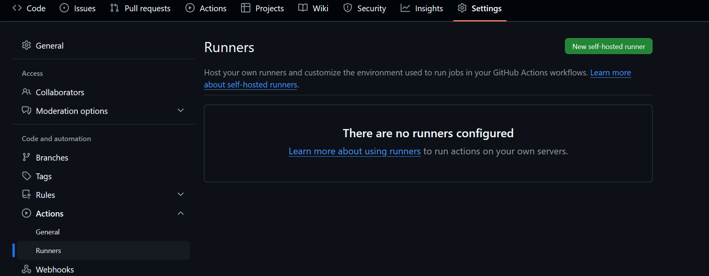
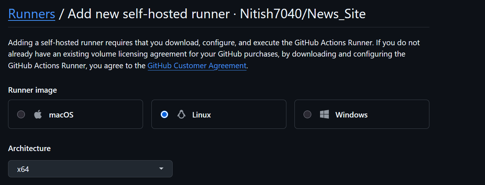
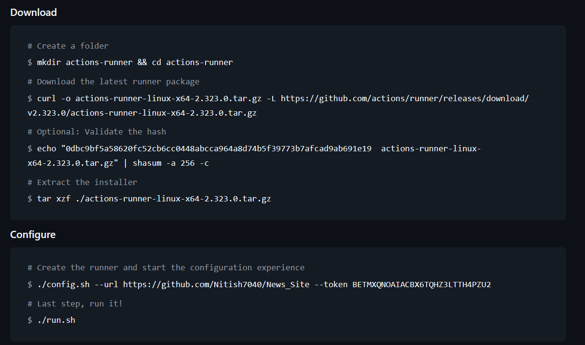
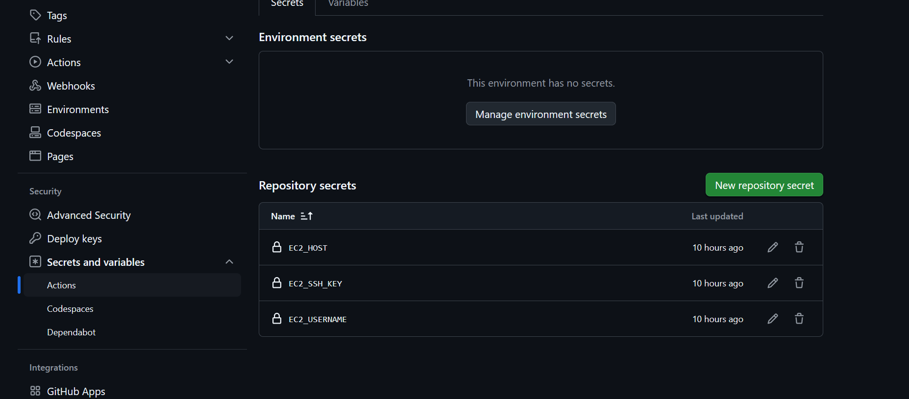

# CI/CD Pipeline Setup for React and Node.js Application on EC2

This document outlines the steps to set up a CI/CD pipeline for a React frontend and Node.js backend on an EC2 Ubuntu server using GitHub Actions, Nginx, PM2, and Docker.

## Prerequisites

- Ubuntu EC2 Server running on AWS
- GitHub repository for both frontend (React) and backend (Node.js)
- Nginx installed on the server
- PM2 installed on the server for process management
- Node.js and npm installed on the server

## Step 1: Install Prerequisites on EC2 Server

### Install Node.js and npm

```bash
sudo apt update
sudo apt install -y nodejs npm
```

### Install PM2

```bash
sudo npm install -g pm2
```

### Install Nginx

```bash
sudo apt install nginx
```

## Step 2: Create and Configure GitHub Actions Runner on Ubuntu

1. Download and Configure GitHub Actions Runner
First, navigate to your repository in GitHub and follow these steps to set up the GitHub Actions runner on your EC2 instance:

Go to your GitHub repository and click on Settings > Actions > Runners.

Click on 'New self-hosted runner' and follow the instructions to set up the runner on your EC2 instance.

2. Create a folder in the ec2 for runner :-

```bash
mkdir actions-runner && cd actions-runner
```

3. Run the below command to download the runner in ec2 folder :-


Here is a simplified version of the commands:
...screenshots...







4. Add Secrets to GitHub Repository
Go to your GitHub repository settings, and under Secrets > Actions, add necessary secrets such as:


- EC2_SERVER_IP
- EC2_USER
- EC2_PRIVATE_KEY
- NODE_ENV

## Step 4: Create GitHub Actions Workflow File

1. Create a .github/workflows/ci-cd.yml file :-

```yaml
name: CI/CD for Test App (Client + Server)

on:
  push:
    branches:
      - main

jobs:
  deploy:
    runs-on: ubuntu-latest

    steps:
      # Step 1: Checkout Repo
      - name: 📥 Checkout repository
        uses: actions/checkout@v4

      # Step 2: 🚀 Copy code to EC2
      - name: 🚀 Copy project to EC2
        uses: appleboy/scp-action@v0.1.7
        with:
          host: ${{ secrets.EC2_HOST }}
          username: ${{ secrets.EC2_USERNAME }}
          key: ${{ secrets.EC2_SSH_KEY }}
          source: "."
          target: "~/test"

      # Step 3: 🛠️ SSH into EC2 and deploy
      - name: 🛠️ Deploy on EC2 via SSH
        uses: appleboy/ssh-action@v1.0.0
        with:
          host: ${{ secrets.EC2_HOST }}
          username: ${{ secrets.EC2_USERNAME }}
          key: ${{ secrets.EC2_SSH_KEY }}
          script: |
            echo "📂 Switching to test directory"
            cd ~/test

            echo "📦 Installing server dependencies"
            cd Server
            npm ci

            echo "🚀 Restarting backend using PM2"
            pm2 restart backend || pm2 start npm --name backend -- start
            cd ..

            echo "📦 Installing client dependencies"
            cd Client
            npm ci

            echo "⚙️ Building React app"
            npm run build

            echo "🌐 Restarting frontend with PM2"
            pm2 serve dist 3000 --name frontend --spa
            cd ..

            echo "💾 Saving PM2 process list"
            pm2 save

            echo "🔁 Reloading Nginx"
            sudo nginx -t && sudo systemctl reload nginx

            echo "✅ Deployment complete!"
```

## Step 5: Set Up the Test Folder and Nginx Configuration on EC2

1. Create the test folder on EC2 :-

```bash
mkdir /path/to/your/test-app
```

2. Create Nginx Configuration for React and Node.js
Create a new configuration file for your test application:-

```bash
sudo nano /etc/nginx/sites-available/test-app
```

Insert the following configuration:-
    
```nginx
server {
    listen 80;
    server_name ec2-13-201-184-236.ap-south-1.compute.amazonaws.com;

    # Proxy for React frontend
    location / {
        proxy_pass http://localhost:3000;  # Assuming React is running on port 3000
        proxy_http_version 1.1;
        proxy_set_header Upgrade $http_upgrade;
        proxy_set_header Connection 'upgrade';
        proxy_set_header Host $host;
        proxy_cache_bypass $http_upgrade;
    }

    # Proxy for Node.js backend API
    location /api/ {
        proxy_pass http://localhost:5000;  # Assuming Node.js backend is running on port 5000
        proxy_http_version 1.1;
        proxy_set_header Upgrade $http_upgrade;
        proxy_set_header Connection 'upgrade';
        proxy_set_header Host $host;
        proxy_cache_bypass $http_upgrade;
    }
}
```

3. Create Symbolic Link for Nginx
Create a symbolic link to enable the site :-

```bash
sudo ln -s /etc/nginx/sites-available/test-app /etc/nginx/sites-enabled/
```

4. Test Nginx Configuration
Test the Nginx configuration to ensure there are no syntax errors:

```bash
sudo nginx -t
```

5. Restart Nginx :-
    
```bash
sudo systemctl reload nginx
```